# Foundation Domain - Architecture Diagrams

**Document Version**: 1.0.0
**Date**: January 11, 2026
**Author**: Agent 4 of 4 (Production Readiness Team)
**Platform**: Gogidix Rapid Assist Platform

---

## Table of Contents

1. [Platform Overview](#1-platform-overview)
2. [Service Integration Diagram](#2-service-integration-diagram)
3. [Per-Domain Architecture](#3-per-domain-architecture)
   - 3.1 AI-Services Domain
   - 3.2 Central-Configuration Domain
   - 3.3 Centralized-Dashboard Domain
   - 3.4 Shared-Infrastructure Domain
   - 3.5 Shared-Libraries Domain
4. [Multi-tenancy Architecture](#4-multi-tenancy-architecture)
5. [Data Flow Architecture](#5-data-flow-architecture)
6. [Security Architecture](#6-security-architecture)
7. [Deployment Architecture](#7-deployment-architecture)

---

## 1. Platform Overview

### 1.1 Foundation Domain Components

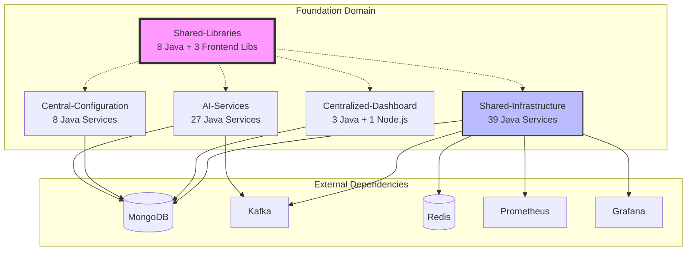

### 1.2 Domain Responsibilities

| Domain | Responsibility | Services | Port Range |
|--------|---------------|----------|------------|
| **AI-Services** | AI/ML capabilities, analytics, recommendations | 27 | 8100-8126 |
| **Central-Configuration** | Feature flags, localization, policies | 8 | 8000-8007 |
| **Centralized-Dashboard** | Dashboards, analytics, reporting | 4 | 3000, 8200-8202 |
| **Shared-Infrastructure** | Cross-cutting infrastructure services | 39 | 8300-8338 |
| **Shared-Libraries** | Reusable components (not deployed) | 0 | N/A |

---

## 2. Service Integration Diagram

### 2.1 How Business and Management Domains Integrate

```mermaid
graph TB
    subgraph "Business Domain Services"
        BS[Booking Service]
        RS[Roadside Service]
        PS[Payment Service]
        NS[Notification Service]
    end

    subgraph "Management Domain Services"
        AS[Admin Service]
        US[User Management]
        OS[Operations Service]
    end

    subgraph "Foundation Domain - Shared-Infrastructure"
        GW[API Gateway<br/>:8304]
        SR[Service Registry<br/>:8333]
        CFG[Config Service<br/>:8000]
        AUTH[Identity Service<br/>:8316]
        AC[Access Control<br/>:8300]
        AUDIT[Audit Service<br/>:8312]
        METRICS[Metrics Service<br/>:8321]
    end

    subgraph "Foundation Domain - Shared-Libraries"
        SL1[common-domain-models]
        SL2[shared-security-library]
        SL3[shared-observability-library]
        SL4[shared-audit-library]
        SL5[shared-request-context]
    end

    BS --> GW
    RS --> GW
    PS --> GW
    NS --> GW
    AS --> GW
    US --> GW
    OS --> GW

    GW --> AUTH
    GW --> AC

    BS -.-> SL2
    RS -.-> SL2
    PS -.-> SL2
    AS -.-> SL2
    US -.-> SL2

    BS -.-> SL3
    RS -.-> SL3
    PS -.-> SL3
    AS -.-> SL3

    BS -.-> SL4
    RS -.-> SL4
    PS -.-> SL4
    AS -.-> SL4

    BS -.-> SL5
    RS -.-> SL5
    PS -.-> SL5

    BS --> SR
    RS --> SR
    PS --> SR
    AS --> SR
    US --> SR

    BS --> CFG
    RS --> CFG
    PS --> CFG
    AS --> CFG
    US --> CFG

    BS --> AUDIT
    RS --> AUDIT
    PS --> AUDIT
    AS --> AUDIT

    BS --> METRICS
    RS --> METRICS
    PS --> METRICS
    AS --> METRICS

    style SL2 fill:#f9f,stroke:#333,stroke-width:2px
    style SL3 fill:#f9f,stroke:#333,stroke-width:2px
    style SL4 fill:#f9f,stroke:#333,stroke-width:2px
    style SL5 fill:#f9f,stroke:#333,stroke-width:2px
```

### 2.2 Library Consumption Pattern

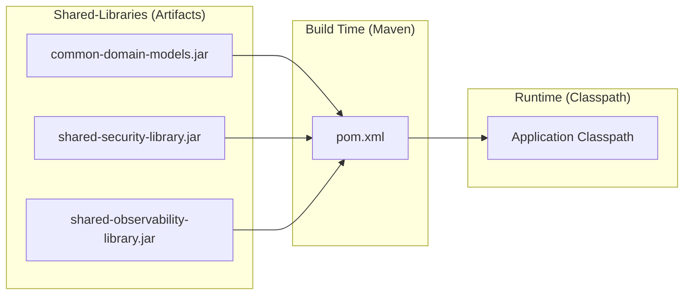

---

## 3. Per-Domain Architecture

### 3.1 AI-Services Domain Architecture

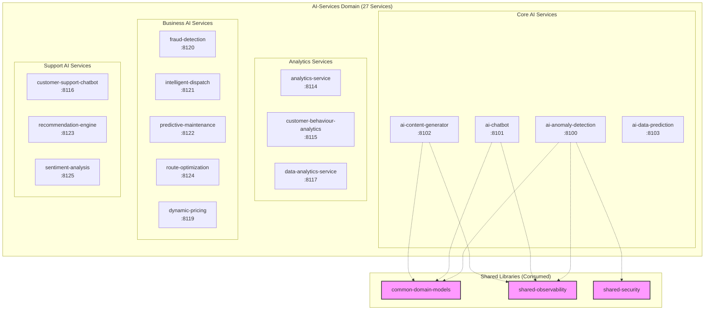

#### AI-Services Hexagonal Architecture (Per Service)

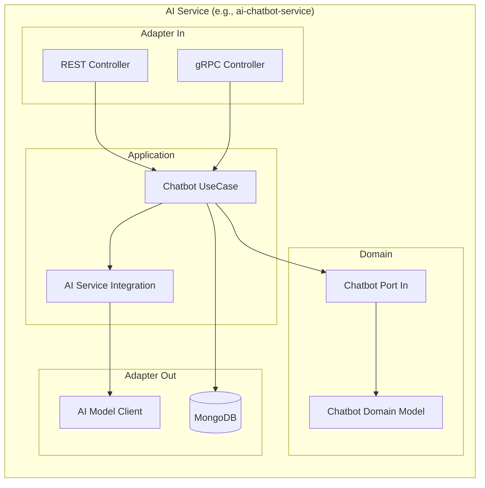

---

### 3.2 Central-Configuration Domain Architecture

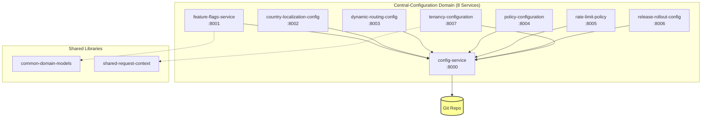

#### Configuration Service Internal Architecture

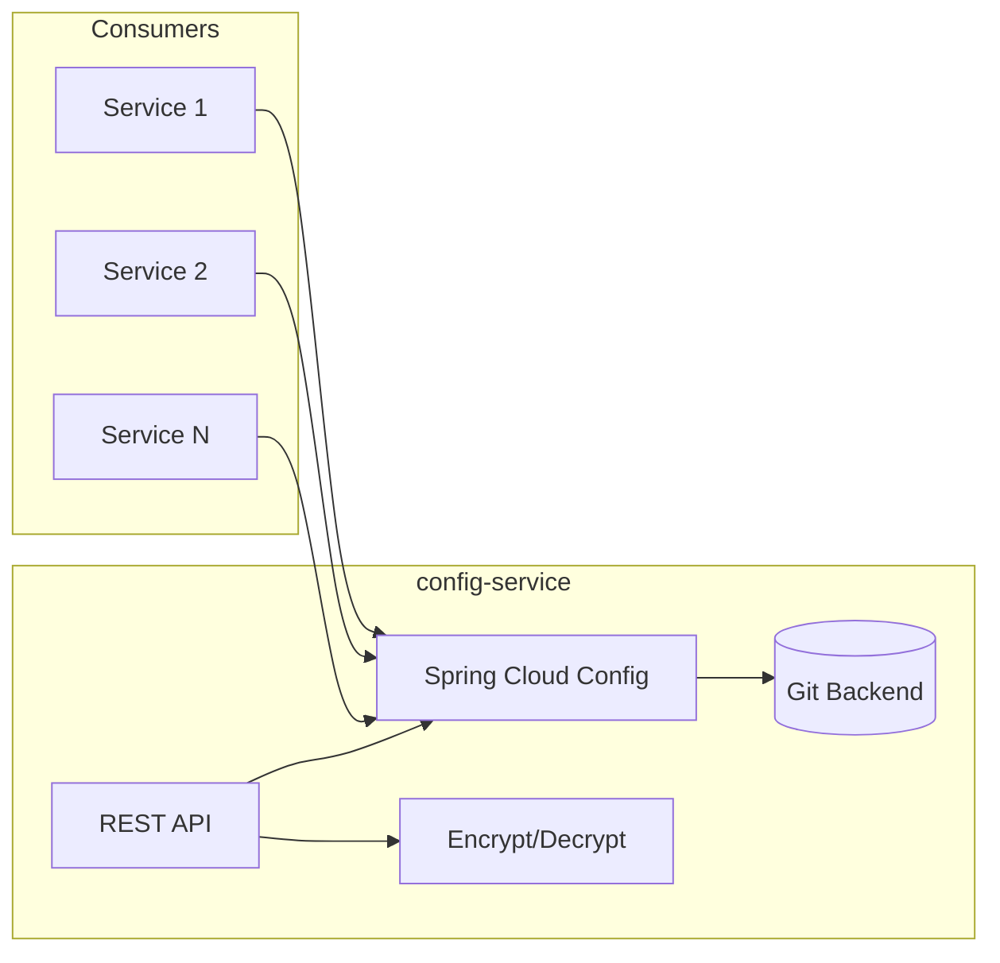

---

### 3.3 Centralized-Dashboard Domain Architecture

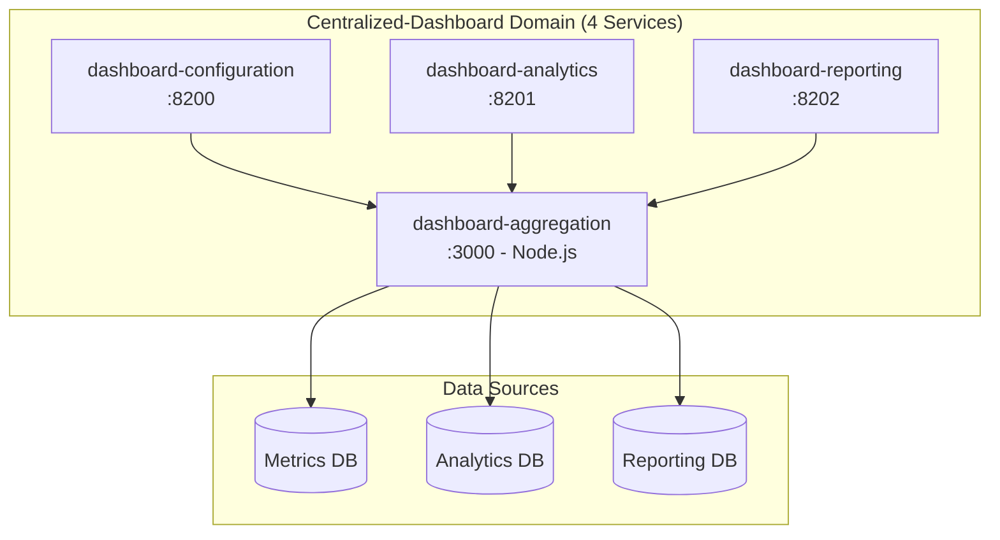

#### Dashboard Aggregation Service (Node.js)

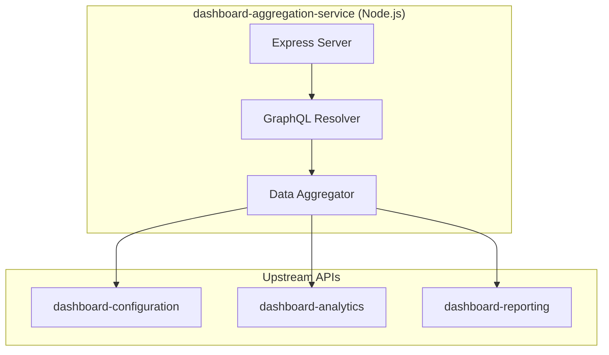

---

### 3.4 Shared-Infrastructure Domain Architecture

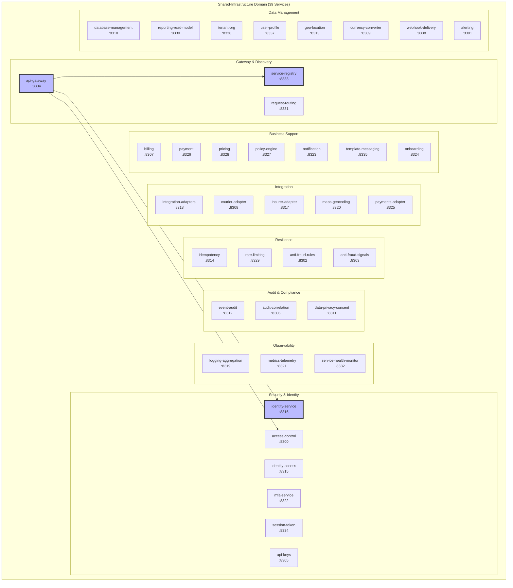

---

### 3.5 Shared-Libraries Domain Architecture

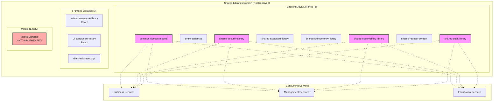

#### Shared Library Internal Architecture

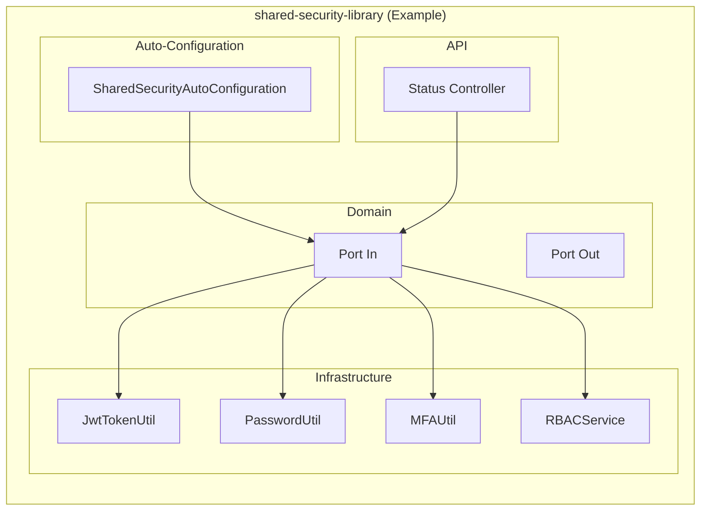

#### Library Dependency Graph

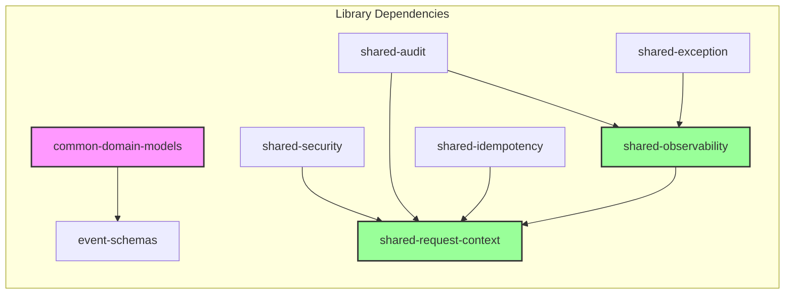

---

## 4. Multi-tenancy Architecture

### 4.1 Tenant Isolation Strategy

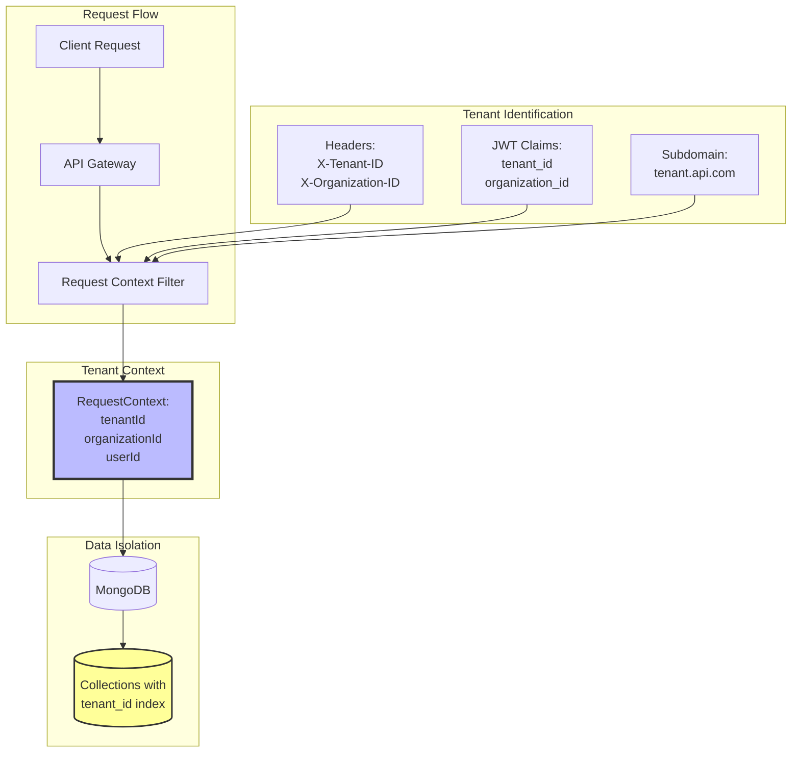

### 4.2 Tenant Data Isolation

```mermaid
graph LR
    subgraph "Database: rapid_assist_db"
        subgraph "Collection: customers"
            C1[_id, tenant_id, ...]
            C2[_id, tenant_id, ...]
        end

        subgraph "Collection: service_requests"
            S1[_id, tenant_id, ...]
            S2[_id, tenant_id, ...]
        end

        subgraph "Collection: providers"
            P1[_id, tenant_id, ...]
            P2[_id, tenant_id, ...]
        end
    end

    subgraph "Queries"
        Q1[db.customers.find({tenant_id: "tenant1"})]
        Q2[db.service_requests.find({tenant_id: "tenant1"})]
    end

    Q1 --> C1
    Q2 --> S1
```

### 4.3 Tenant Context Propagation

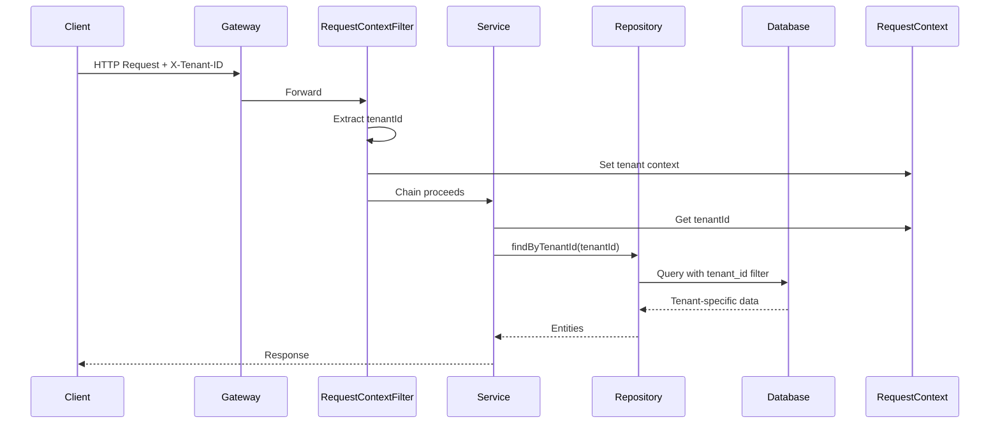

---

## 5. Data Flow Architecture

### 5.1 Synchronous Request Flow

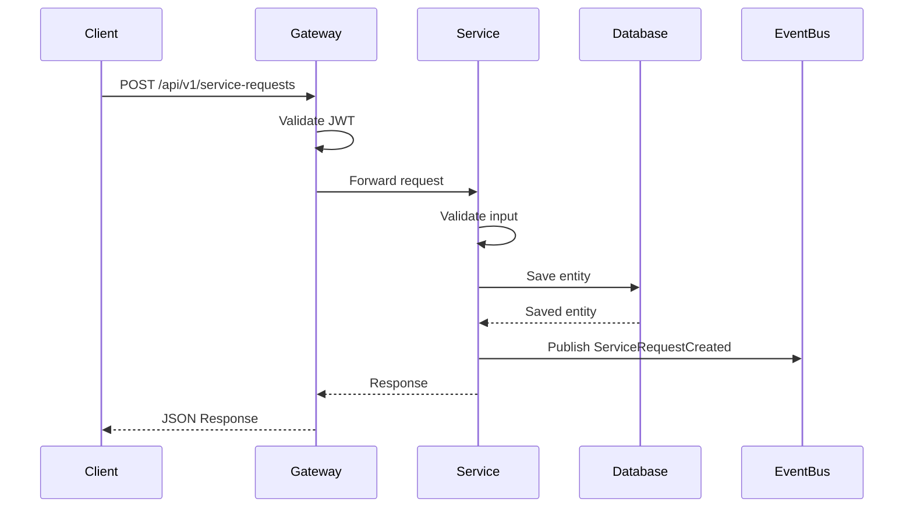

### 5.2 Asynchronous Event Flow

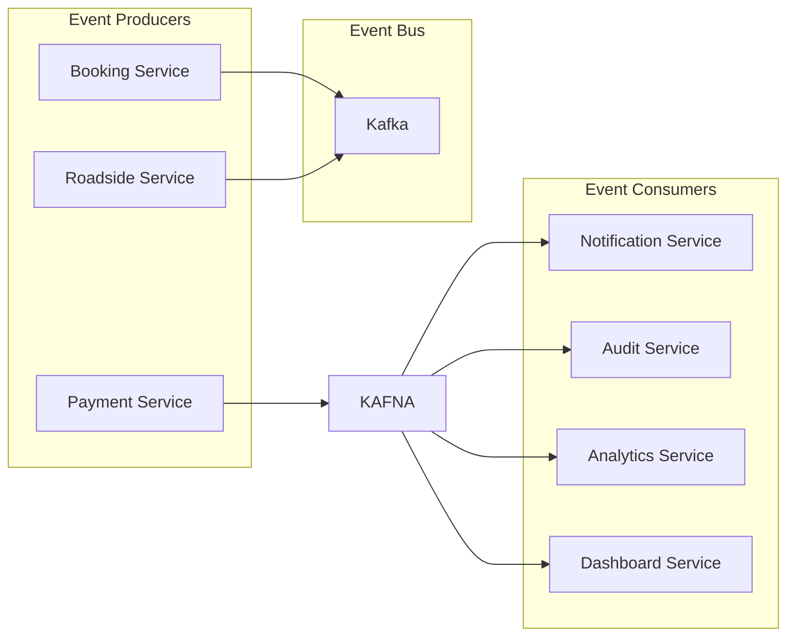

### 5.3 Event Schemas Flow

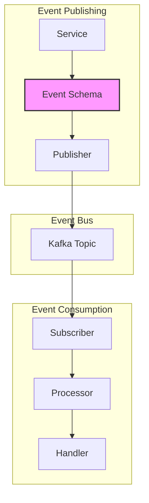

---

## 6. Security Architecture

### 6.1 Authentication & Authorization Flow

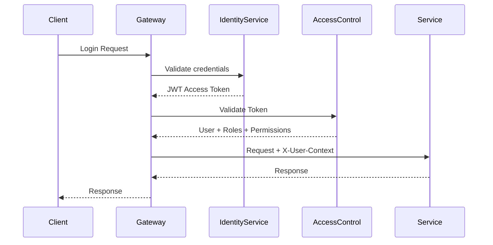

### 6.2 Security Library Integration

```mermaid
graph TB
    subgraph "shared-security-library"
        JWT[JwtTokenUtil]
        PWD[PasswordUtil]
        MFA[MFAUtil]
        RBAC[RBACService]
    end

    subgraph "Services Using Security"
        S1[identity-service]
        S2[access-control-service]
        S3[All Services]
    end

    subgraph "Security Features"
        AUTH[Authentication]
        AUTHZ[Authorization]
        MFA_F[MFA]
        PWD_M[Password Management]
    end

    S1 --> JWT
    S1 --> PWD
    S1 --> MFA
    S2 --> RBAC
    S3 --> JWT

    JWT --> AUTH
    RBAC --> AUTHZ
    MFA --> MFA_F
    PWD --> PWD_M
```

### 6.3 API Security Layers

```mermaid
graph TB
    subgraph "Layer 1: Network Security"
        CORS[CORS Configuration]
        CSRF[CSRF Protection]
        RATE[Rate Limiting]
    end

    subgraph "Layer 2: Authentication"
        JWT[JWT Validation]
        API_KEY[API Key Validation]
        MFA[MFA Check]
    end

    subgraph "Layer 3: Authorization"
        RBAC[Role-Based Access Control]
        PERM[Permission Checker]
        TENANT[Tenant Isolation]
    end

    subgraph "Layer 4: Input Validation"
        VAL[Input Validation]
        SAN[Input Sanitization]
        XSS[XSS Protection]
    end

    CLIENT[Client] --> CORS
    CORS --> CSRF
    CSRF --> RATE
    RATE --> JWT
    JWT --> API_KEY
    API_KEY --> MFA
    MFA --> RBAC
    RBAC --> PERM
    PERM --> TENANT
    TENANT --> VAL
    VAL --> SAN
    SAN --> XSS
    XSS --> SERVICE[Service]
```

---

## 7. Deployment Architecture

### 7.1 Railway Deployment

```mermaid
graph TB
    subgraph "Railway Cloud"
        subgraph "Production Environment"
            subgraph "Foundation Services"
                AI[AI Services<br/>27 services]
                CC[Config Services<br/>8 services]
                CD[Dashboard Services<br/>4 services]
                SI[Infrastructure Services<br/>39 services]
            end
        end

        subgraph "Infrastructure"
            PG[Railway PostgreSQL]
            REDIS[Railway Redis]
            MONGO[Railway MongoDB]
        end

        subgraph "Observability"
            PROM[Railway Metrics]
            LOGS[Railway Logs]
        end
    end

    AI --> MONGO
    CC --> PG
    CD --> MONGO
    SI --> MONGO
    SI --> REDIS
    SI --> PROM
    SI --> LOGS
```

### 7.2 Service Health Monitoring

```mermaid
graph LR
    subgraph "Services"
        S1[Service 1]
        S2[Service 2]
        S3[Service N]
    end

    subgraph "Health Endpoints"
        H1[/actuator/health]
        H2[/actuator/health]
        H3[/actuator/health]
    end

    subgraph "Monitoring"
        PROM[Prometheus]
        GRAF[Grafana]
        ALRT[Alertmanager]
    end

    S1 --> H1
    S2 --> H2
    S3 --> H3
    H1 --> PROM
    H2 --> PROM
    H3 --> PROM
    PROM --> GRAF
    PROM --> ALRT
```

### 7.3 CI/CD Pipeline

```mermaid
graph TB
    subgraph "GitHub"
        GH[GitHub Repository]
        PR[Pull Request]
        PUSH[Push to Main]
    end

    subgraph "GitHub Actions"
        BUILD[Build & Test]
        SECURITY[Security Scan]
        DEPLOY[Deploy to Railway]
    end

    subgraph "Artifacts"
        DOCKER[Docker Image]
        JAR[JAR Artifact]
    end

    subgraph "Railway"
        STG[Staging]
        PROD[Production]
    end

    PR --> BUILD
    PUSH --> BUILD
    BUILD --> SECURITY
    BUILD --> DOCKER
    BUILD --> JAR
    SECURITY --> DEPLOY
    DEPLOY --> STG
    DEPLOY --> PROD
```

---

## 8. Foundation Domain Service Map

### 8.1 Complete Service Inventory

```mermaid
mindmap
    root((Foundation Domain<br/>78 Services))
        AI-Services<br/>(27)
            Core AI
                Anomaly Detection
                Chatbot
                Content Generator
                Data Prediction
            Analytics
                Analytics
                Customer Behaviour
                Data Analytics
                Document Intelligence
            Business AI
                Fraud Detection
                Intelligent Dispatch
                Predictive Maintenance
                Route Optimization
                Dynamic Pricing
            Support AI
                Customer Support Chatbot
                Recommendation Engine
                Sentiment Analysis
        Central-Config<br/>(8)
            Config Service
            Feature Flags
            Localization
            Dynamic Routing
            Policy Config
            Rate Limit Policy
            Release Rollout
            Tenancy Config
        Dashboard<br/>(4)
            Dashboard Configuration
            Dashboard Analytics
            Dashboard Reporting
            Dashboard Aggregation
        Infrastructure<br/>(39)
            Gateway & Discovery
                API Gateway
                Service Registry
                Request Routing
            Security & Identity
                Identity Service
                Identity Access
                Access Control
                MFA Service
                Session Token
                API Keys
            Observability
                Logging Aggregation
                Metrics Telemetry
                Health Monitor
            Audit & Compliance
                Event Audit
                Audit Correlation
                Data Privacy Consent
            Resilience
                Idempotency
                Rate Limiting
                Anti-Fraud Rules
                Anti-Fraud Signals
            Integration
                Integration Adapters
                Courier Adapter
                Insurer Adapter
                Maps Geocoding
                Payments Adapter
            Business Support
                Billing
                Payment
                Pricing
                Policy Engine
                Notification
                Template Messaging
                Onboarding
            Data Management
                Database Management
                Reporting Read Model
                Tenant Org
                User Profile
                Geo Location
                Currency Converter
                Webhook Delivery
                Alerting
        Shared-Libraries<br/>(11)
            Java (8)
                Common Domain Models
                Event Schemas
                Shared Audit
                Shared Exception
                Shared Idempotency
                Shared Observability
                Shared Request Context
                Shared Security
            Frontend (3)
                Admin Framework
                UI Component Library
                Client SDK TypeScript
```

---

## Appendix A: Port Allocation

| Domain | Services | Port Range | Notes |
|--------|----------|------------|-------|
| **AI-Services** | 27 | 8100-8126 | AI/ML capabilities |
| **Central-Config** | 8 | 8000-8007 | Configuration management |
| **Centralized-Dashboard** | 4 | 3000, 8200-8202 | 3000 is Node.js |
| **Shared-Infrastructure** | 39 | 8300-8338 | Cross-cutting services |
| **Shared-Libraries** | 0 | N/A | Libraries, not services |
| **TOTAL** | **78** | **3000, 8000-8338** | 77 Java + 1 Node.js |

---

## Appendix B: Technology Stack

| Component | Technology | Version |
|-----------|------------|---------|
| **Backend Language** | Java | 21 |
| **Framework** | Spring Boot | 3.3.5 |
| **Build Tool** | Maven | Latest |
| **Database** | MongoDB | Latest |
| **Message Broker** | Kafka | Latest |
| **Cache** | Redis | Latest |
| **Observability** | Micrometer + Prometheus | Latest |
| **Tracing** | Brave (Zipkin) | Latest |
| **Frontend** | React | 18.3.1 |
| **Frontend Build** | Vite | 5.4.10 |
| **TypeScript** | TypeScript | 5.x |
| **Node.js** | Node.js | 20.x |
| **Deployment** | Railway | N/A |
| **CI/CD** | GitHub Actions | N/A |

---

**Document Status**: Complete
**Last Updated**: January 11, 2026
**Next Review**: After architecture changes or new domain additions
